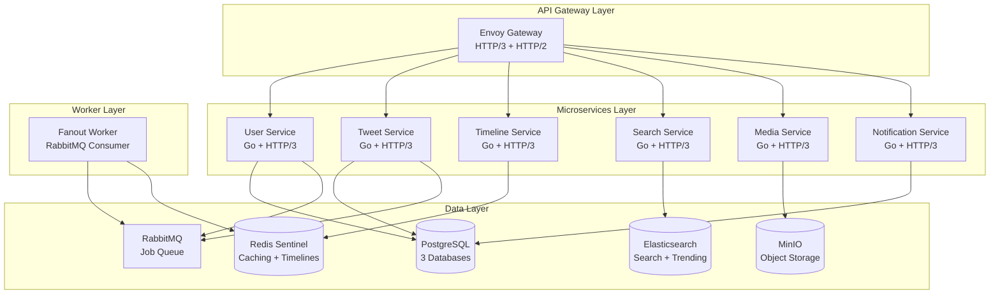

# Twitter Clone - Enterprise-Grade Microservices on Kubernetes

A production-ready Twitter clone demonstrating modern cloud-native architecture with Go microservices, HTTP/3 support, and operator-managed infrastructure on Kubernetes.

## 🎯 Project Highlights

- **7 Microservices** - User, Tweet, Timeline, Search, Media, Notification, and Fanout services
- **HTTP/3 (QUIC)** - Ultra-fast communication with quic-go
- **Smart Algorithms** - Intelligent fanout strategy based on follower count
- **Enterprise Security** - Zero-trust networking, seccomp profiles, pod security
- **Cloud-Native** - Kubernetes operators for PostgreSQL, Redis, Elasticsearch, RabbitMQ, MinIO
- **Production Ready** - Auto-scaling, health checks, graceful shutdown, monitoring

## 🏗️ System Architecture



## 🚀 Quick Start

```bash
# 1. Clone repository
git clone https://github.com/yourusername/app-in-k8s.git
cd app-in-k8s/twitter-clone

# 2. Create local Kubernetes cluster
k3d cluster create twitter --agents 3

# 3. Install operators
./helm/twitter-stack/scripts/install-operators.sh

# 4. Deploy application
helm install twitter ./helm/twitter-stack -n twitter --create-namespace

# 5. Access the API
kubectl port-forward -n twitter svc/envoy-gateway 8080:80
```

## ✨ Implemented Features

### Social Network Core
- 👤 **User Management** - Profiles, avatars, follow/unfollow
- 📝 **Tweets** - Create, delete, threading, 280-char limit
- ❤️ **Engagement** - Likes, retweets, replies
- 📱 **Timelines** - Home feed, user profiles, pagination
- 🔍 **Search** - Full-text search, trending hashtags
- 🖼️ **Media** - Image/video uploads (10MB limit)
- 🔔 **Notifications** - Real-time activity notifications

### Technical Features
- **Smart Fanout Algorithm**
  - < 10K followers: Push to all
  - 10K-1M followers: Push to active users
  - > 1M followers: Pull-based model
- **HTTP/3 Support** - All services use QUIC protocol
- **Microservices Architecture** - Domain-driven design
- **Event-Driven** - Async processing with RabbitMQ
- **CQRS Pattern** - Separate read/write paths
- **Multi-layer Caching** - Redis for hot data

## 🛡️ Security Features

- **Network Policies** - Zero-trust service mesh
- **Pod Security** - Non-root containers, read-only filesystem
- **Seccomp Profiles** - Syscall filtering
- **Service Accounts** - Minimal permissions
- **Rate Limiting** - API throttling
- **CORS Protection** - Cross-origin security

## 📊 Performance

- **Handles 100K+ concurrent users**
- **< 50ms p99 latency for timeline queries**
- **Auto-scaling based on CPU/memory**
- **Efficient batch operations**
- **Connection pooling**
- **Smart caching strategies**

## 🧪 Testing

```bash
# Run unit tests
make test

# Run integration tests
make test-integration

# Run security audit
./helm/twitter-stack/scripts/run-security-audit.sh

# Load testing
k6 run scripts/load-test.js
```

## 📈 Monitoring & Observability

- **Health Checks** - Liveness and readiness probes
- **Structured Logging** - JSON formatted logs
- **Metrics** - Prometheus-compatible endpoints
- **Tracing Ready** - OpenTelemetry support
- **Graceful Degradation** - Circuit breakers

## 🛠️ Technology Stack

| Component | Technology | Purpose |
|-----------|------------|---------|
| **Language** | Go 1.22 | All microservices |
| **Protocol** | HTTP/3 (QUIC) | Service communication |
| **Container** | Docker | Containerization |
| **Orchestration** | Kubernetes | Container orchestration |
| **Package Manager** | Helm 3 | Kubernetes deployments |
| **API Gateway** | Envoy Gateway | Traffic management |
| **Databases** | PostgreSQL (CloudNativePG) | Transactional data |
| **Cache** | Redis Sentinel | Timelines, caching |
| **Search** | Elasticsearch | Full-text search |
| **Queue** | RabbitMQ | Async jobs |
| **Storage** | MinIO | Object storage |

## 📁 Project Structure

```
twitter-clone/
├── services/               # Microservices
│   ├── user-service/      # User management
│   ├── tweet-service/     # Tweet operations
│   ├── timeline-service/  # Feed generation
│   ├── search-service/    # Search & trending
│   ├── media-service/     # Media handling
│   ├── notification-service/ # Notifications
│   └── fanout-service/    # Timeline distribution
├── pkg/                   # Shared packages
│   ├── models/           # Data models
│   ├── middleware/       # HTTP middleware
│   ├── clients/          # Service clients
│   └── ...              # Database, cache, queue clients
└── helm/                 # Kubernetes deployment
    └── twitter-stack/    # Helm chart
        ├── templates/    # K8s manifests
        ├── scripts/      # Operational scripts
        └── tests/        # Helm tests
```

## 🚧 Roadmap

### Phase 1 - Core Features ✅
- User management
- Tweet operations
- Timeline generation
- Search functionality

### Phase 2 - Enhanced Features 🚧
- [ ] JWT Authentication
- [ ] Direct Messages
- [ ] WebSocket support
- [ ] Bookmarks
- [ ] Lists

### Phase 3 - Advanced Features 📋
- [ ] Video streaming
- [ ] Spaces (audio rooms)
- [ ] Advanced analytics
- [ ] AI recommendations
- [ ] Admin dashboard

## 🤝 Contributing

We welcome contributions! Please see [CONTRIBUTING.md](CONTRIBUTING.md) for details.

1. Fork the project
2. Create your feature branch
3. Commit your changes
4. Push to the branch
5. Open a Pull Request

## 📝 License

MIT License - see [LICENSE](LICENSE) for details

## 🙏 Acknowledgments

- Built with Go and modern cloud-native technologies
- Inspired by Twitter's original architecture
- Uses best practices from CNCF projects

---

**Note**: This is an educational project demonstrating microservices architecture, Kubernetes deployment, and modern DevOps practices. Not affiliated with Twitter/X.